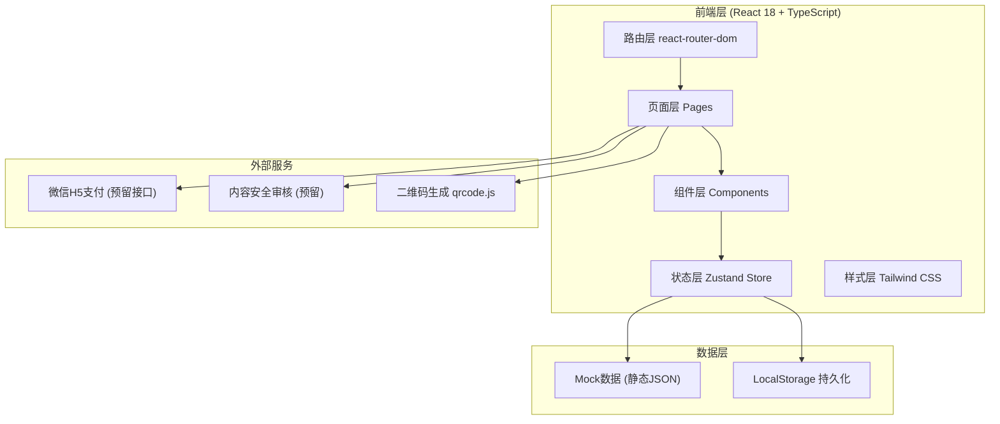

# 电子杂货铺·童年的味道 - 技术架构文档

## 1. 架构设计



## 2. 技术栈说明

- **前端框架**: React@18.3.1 + TypeScript@5.8.3
- **初始化工具**: Vite@6.3.5 (vite-init)
- **路由管理**: react-router-dom@7.3.0
- **状态管理**: zustand@5.0.3
- **样式方案**: tailwindcss@3.4.17 + autoprefixer + postcss
- **UI组件库**: 自定义手绘/拟物化组件
- **图标库**: lucide-react@0.511.0
- **工具函数**: clsx@2.1.1 + tailwind-merge@3.0.2
- **后端**: 无后端，使用Mock数据 + LocalStorage模拟
- **数据库**: LocalStorage持久化存储

## 3. 路由定义

| 路由路径 | 页面名称 | 用途说明 |
|---------|---------|---------|
| `/` | 首页Home | 杂货铺门面、Banner、分区入口、推荐、答题入口、弹幕 |
| `/category/:type` | 商品列表Category | 四大分区货架、筛选排序、商品卡片 |
| `/product/:id` | 商品详情Product | 商品大图、回忆故事、晒单、加购购买 |
| `/quiz` | 答题闯关Quiz | 每日答题、抽奖、排行榜 |
| `/cart` | 购物车Cart | 商品管理、合计、推荐商品 |
| `/checkout` | 结算下单Checkout | 收货地址、支付方式、确认订单 |
| `/order-success` | 订单成功OrderSuccess | 怀旧小票展示、保存分享 |
| `/profile` | 个人中心Profile | 订单/优惠券/弹幕/答题/收藏入口 |
| `/profile/orders` | 我的订单OrderList | 待付款/待发货/待收货/已完成 |
| `/profile/coupons` | 我的优惠券CouponList | 可用/已用/过期优惠券 |
| `/profile/favorites` | 我的收藏Favorites | 收藏的童年商品清单 |

## 4. 目录结构

```
src/
├── assets/                 # 静态资源（图片、音频）
│   ├── images/             # 商品图、背景图等
│   └── audio/              # 背景音乐、音效
├── components/             # 公共组件
│   ├── layout/             # 布局组件（Header、Footer、NavBar）
│   ├── product/            # 商品相关（ProductCard、PriceTag、StarRating）
│   ├── home/               # 首页组件（Banner、CategoryCard、FallingItems、Danmaku）
│   ├── quiz/               # 答题组件（QuestionCard、Lottery、Ranking）
│   ├── order/              # 订单组件（CartItem、Receipt、AddressForm）
│   └── common/             # 通用组件（Modal、Button、Toast、Empty）
├── pages/                  # 页面组件
│   ├── Home.tsx
│   ├── Category.tsx
│   ├── Product.tsx
│   ├── Quiz.tsx
│   ├── Cart.tsx
│   ├── Checkout.tsx
│   ├── OrderSuccess.tsx
│   └── profile/
│       ├── Profile.tsx
│       ├── OrderList.tsx
│       ├── CouponList.tsx
│       └── Favorites.tsx
├── store/                  # Zustand状态管理
│   ├── useCartStore.ts     # 购物车状态
│   ├── useUserStore.ts     # 用户状态（订单、收藏、优惠券）
│   ├── useQuizStore.ts     # 答题状态
│   └── useDanmakuStore.ts  # 弹幕状态
├── data/                   # Mock数据
│   ├── products.ts         # 商品数据
│   ├── quiz.ts             # 题库数据
│   ├── banners.ts          # Banner数据
│   └── danmaku.ts          # 模拟弹幕数据
├── hooks/                  # 自定义Hooks
│   ├── useFallingItems.ts  # 飘落动画Hook
│   ├── useDanmaku.ts       # 弹幕滚动Hook
│   └── useCountdown.ts     # 倒计时Hook
├── lib/                    # 工具函数
│   └── utils.ts            # 通用工具（cn、formatPrice、storage）
├── types/                  # TypeScript类型定义
│   └── index.ts            # Product、Order、Quiz等接口
├── App.tsx                 # 路由入口
├── main.tsx                # React入口
└── index.css               # 全局样式+Tailwind指令
```

## 5. 状态管理设计

### 5.1 Zustand Store结构

**购物车Store (useCartStore)**:
- `items: CartItem[]` - 购物车商品列表
- `addItem(product, qty)` - 添加商品
- `removeItem(id)` - 删除商品
- `updateQty(id, qty)` - 修改数量
- `clearCart()` - 清空购物车
- `totalPrice` - 合计金额（计算属性）
- `totalCount` - 商品总数

**用户Store (useUserStore)**:
- `orders: Order[]` - 订单列表
- `favorites: string[]` - 收藏商品ID
- `coupons: Coupon[]` - 优惠券列表
- `addresses: Address[]` - 收货地址
- `danmakuRecords: Danmaku[]` - 我的弹幕记录
- `quizRecords: QuizRecord[]` - 答题记录

**答题Store (useQuizStore)**:
- `dailyChances: number` - 今日剩余次数
- `currentQuestions: Question[]` - 当前题目
- `currentIndex: number` - 当前题号
- `correctCount: number` - 已答对数
- `isFinished: boolean` - 是否完成
- `reward: Coupon | null` - 抽奖奖励
- `ranking: RankingItem[]` - 排行榜

### 5.2 持久化策略
- 使用LocalStorage + zustand persist中间件
- 持久化键：`zzh_cart`、`zzh_user`、`zzh_quiz`
- 每日答题机会通过日期判断重置

## 6. 数据模型

### 6.1 TypeScript类型定义

```typescript
// 商品
interface Product {
  id: string;
  name: string;
  category: 'snack' | 'toy' | 'stationery' | 'seasonal';
  price: number;
  originalPrice?: number;
  image: string;
  nostalgiaStars: 1 | 2 | 3 | 4 | 5;
  era: '80s' | '90s' | '00s';
  memoryStory: string;
  coldKnowledge?: string;
  sales: number;
  stock: number;
  tags: string[];
}

// 购物车项
interface CartItem {
  productId: string;
  product: Product;
  quantity: number;
}

// 订单
interface Order {
  id: string;
  items: CartItem[];
  totalAmount: number;
  status: 'pending' | 'paid' | 'shipped' | 'completed';
  address: Address;
  createdAt: string;
  danmaku?: Danmaku;
}

// 收货地址
interface Address {
  id: string;
  name: string;
  phone: string;
  province: string;
  city: string;
  district: string;
  detail: string;
  isDefault: boolean;
}

// 答题
interface Question {
  id: string;
  type: 'image' | 'price' | 'brand' | 'sound';
  content: string;
  image?: string;
  options: string[];
  answerIndex: number;
  explanation: string;
}

// 弹幕
interface Danmaku {
  id: string;
  city: string;
  nickname: string;
  productName: string;
  message: string;
  age: number;
  likes: number;
  createdAt: string;
}

// 优惠券
interface Coupon {
  id: string;
  name: string;
  type: 'discount' | 'shipping' | 'threshold';
  value: number;
  threshold?: number;
  expireAt: string;
  used: boolean;
}
```

### 6.2 Mock数据说明
- 商品数据：60+ SKU，覆盖四大分区，每个分区15+商品
- 题库数据：100+题目，4种题型均匀分布
- Banner数据：5张轮播图（促销+专题+新品）
- 模拟弹幕：30+条预置数据用于滚动展示
- 排行榜：50+条虚拟用户数据
