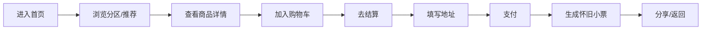
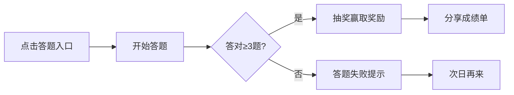

# 电子杂货铺·童年的味道 - 产品需求文档（PRD）

## 1. 产品概述
一款以怀旧零食、玩具、文具为核心商品的H5电商网页，面向80、90后及Z世代年轻群体，通过复古视觉、互动玩法和童年回忆杀内容，打造沉浸式"逛老式杂货铺"的线上体验。

- **核心目标**：让用户在购买童年商品的过程中重温童年记忆，通过互动模块提升用户粘性和分享传播
- **目标用户**：80后、90后怀旧人群，Z世代对复古文化感兴趣的年轻人
- **市场价值**：填补怀旧主题垂直电商空白，利用情感营销和社交裂变实现用户增长

## 2. 核心功能

### 2.1 用户角色
| 角色 | 注册方式 | 核心权限 |
|------|----------|----------|
| 普通用户 | 无需注册（游客模式） | 浏览商品、加入购物车、参与答题、查看弹幕 |
| 会员用户 | 手机号/微信授权 | 下单购买、发布弹幕、查看订单、收藏商品、参与排行榜 |

### 2.2 功能模块
1. **首页**：店招、轮播Banner、四大分区入口、今日怀旧推荐、答题入口、弹幕飘屏
2. **商品列表页**：分区货架、筛选排序、商品卡片、回忆小故事弹窗
3. **商品详情页**：商品大图、回忆故事区、用户晒单墙、加购/购买按钮
4. **童年答题闯关**：每日答题、抽奖奖励、排行榜、成绩单分享
5. **时光机弹幕**：下单发布弹幕、点赞互动、精选回忆专区
6. **购物车/下单**：购物车管理、收货地址、支付流程、怀旧小票
7. **个人中心**：订单管理、优惠券、弹幕记录、答题记录、收藏夹

### 2.3 页面详情
| 页面名称 | 模块名称 | 功能描述 |
|---------|---------|---------|
| 首页 | 店招区域 | 霓虹灯闪烁"电子杂货铺"手写体、背景音乐开关、飘落动画元素 |
| 首页 | 轮播Banner | 限时折扣、新品上架、童年专题等3-5张自动轮播图 |
| 首页 | 四大分区 | 零食铺🍬、玩具摊🪀、文具柜✏️、季节限定🎄图标卡片入口 |
| 首页 | 今日推荐 | 3-5款精选商品横向滑动卡片，支持快速加购 |
| 首页 | 答题入口 | "测测你的童年记忆值"醒目标题按钮 |
| 首页 | 弹幕飘屏 | 底部LED走字屏风格，实时滚动用户下单弹幕 |
| 商品列表页 | 筛选排序 | 价格、销量、上新、怀旧指数（80/90/00年代）筛选 |
| 商品列表页 | 商品卡片 | 玻璃罐/铁皮盒拟物设计、手写体名称、复古价签、怀旧星级、回忆故事 |
| 商品详情页 | 商品展示 | 大图轮播+复古包装细节图 |
| 商品详情页 | 回忆故事 | 年代背景故事文案，引发情感共鸣 |
| 商品详情页 | 用户晒单 | 买家秀图片墙+短评 |
| 商品详情页 | 加购按钮 | 算盘/弹珠机拟物化样式，带微动效 |
| 答题闯关 | 答题界面 | 老式考试卷/田字格风格，5道题含识图/价格/品牌/声音题 |
| 答题闯关 | 抽奖奖励 | 答对3道可抽优惠券/包邮券/限定购买资格 |
| 答题闯关 | 排行榜 | 每周"童年学神榜"，前三奖大礼包 |
| 购物车 | 商品列表 | 竹编篮/铁皮桶视觉，复古价签合计、"再来一包"推荐 |
| 下单流程 | 收货地址 | 表单填写、地址管理 |
| 下单流程 | 怀旧小票 | 供销社收据样式、热敏纸纹理、可保存分享、二维码领券 |
| 个人中心 | 功能菜单 | 订单/优惠券/弹幕/答题/收藏/地址/客服八大入口 |

## 3. 核心流程

### 3.1 购物流程
用户浏览首页→进入分区/商品列表→查看商品详情→加入购物车→去结算→填写收货地址→支付→生成怀旧小票→分享/返回首页

### 3.2 答题流程
用户点击答题入口→开始答题（5题）→答对≥3题抽奖→获得奖励→分享成绩单/返回

## 4. 用户界面设计

### 4.1 设计风格
- **主色调**：暖黄色(#FFE4B5)、牛皮纸色(#D2B48C)、铁锈红(#B22222)、深木色(#8B4513)
- **辅助色**：薄荷绿(#98FB98)、淡粉(#FFB6C1)、天蓝(#87CEEB)
- **按钮风格**：拟物化3D效果，圆角8px，微浮雕阴影，hover时轻微上浮+加深阴影
- **字体**：
  - 标题/商品名：手写体（站酷快乐体/方正静蕾体风格）
  - 正文：清晰复古无衬线体
  - 价格：老式打字机风格数字
- **布局风格**：长滚动式，货架分区感，卡片+木纹背景，模拟逛杂货铺体验
- **图标/emoji**：使用卡通emoji🍬🪀✏️🎄搭配手绘边框装饰

### 4.2 页面设计概览
| 页面名称 | 模块名称 | UI元素 |
|---------|---------|--------|
| 首页 | 店招区域 | 霓虹闪烁字效、暖黄渐变背景、玻璃罐纹理、飘落动画 |
| 首页 | 四大分区 | 圆角卡片、木纹底、emoji大图标、悬停弹跳动画 |
| 商品列表 | 商品卡片 | 玻璃罐高光效果、价签贴纸样式、星级评分、气泡弹窗 |
| 答题页 | 答题界面 | 田字格/试卷边框、手写题号、翻页动画、盖章式对错效果 |
| 购物车 | 购物车页 | 竹编篮背景纹理、算盘合计栏、小票线条分隔 |
| 小票 | 小票弹窗 | 热敏纸噪点纹理、虚线剪裁边、印章水印、二维码 |

### 4.3 响应式设计
- **移动端优先**：375px-414px宽度优化，最大宽度限制480px居中
- **触摸优化**：按钮最小44×44px点击区域，横向滑动卡片支持触摸
- **兼容iPad竖屏**：最大宽度适配，两侧留白装饰背景

### 4.4 动画动效
- 卡片hover：3°倾斜+translateY(-4px)+阴影加深
- 加购按钮：模拟"扔进篮子"抛物线动效
- 弹幕：平滑左移滚动，速度30s/屏
- 答题翻页：书卷翻页过渡效果
- 飘落元素：随机路径+旋转下落+淡入淡出
